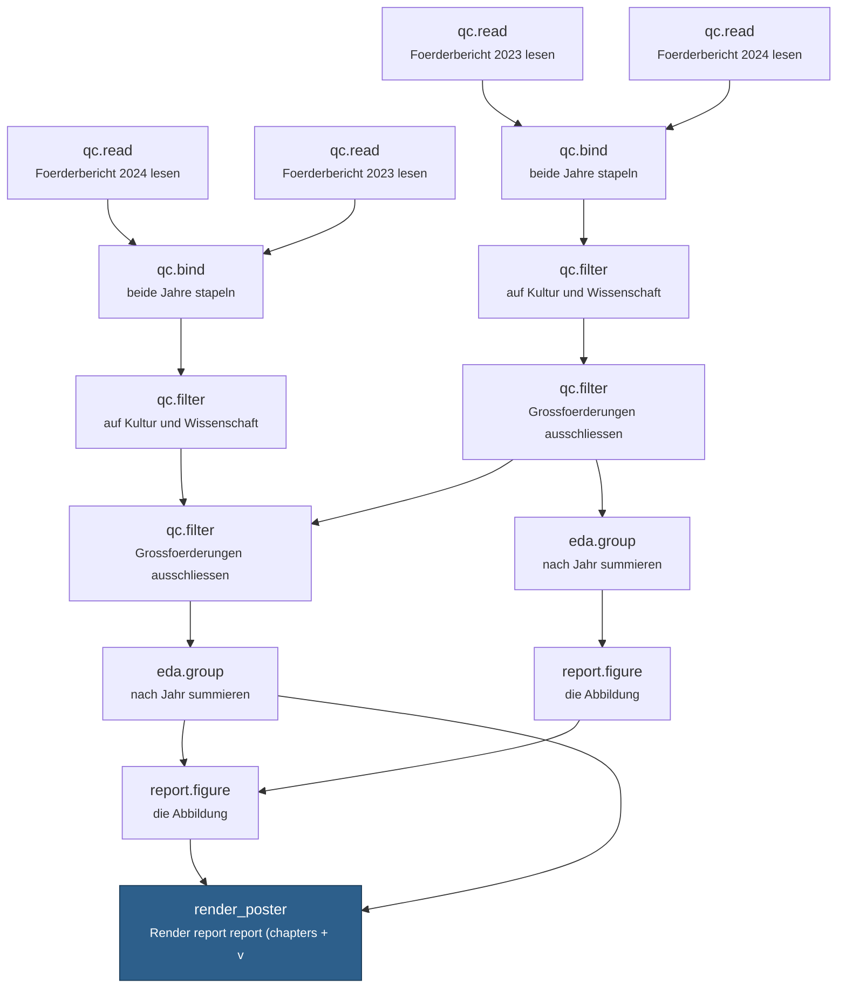

# jourfixe-demo

**A published report and everything it was made of.** No improve, no login, no server — the poster
and its complete lineage as ordinary files in a git repository.

📄 **[The report → `poster/JAM-POSTER.pdf`](poster/JAM-POSTER.pdf)** · [as HTML](poster/JAM-POSTER.html)
🔎 **[Interactive lineage viewer](https://gitmick.github.io/jourfixe-demo/)**

---

## What the poster is made of

15 computations, 16 dependencies between them, walked from the step
that rendered the poster backwards to the raw CSVs. Every box below is a directory in
[`lineage/steps/`](lineage/steps) holding that computation's actual input and output bytes.

The two parallel chains are the point of the demo: **the same nine-step workflow, run twice, with
one bound file different.** One run excludes grants above 50 million as "individual decisions that
distort the year-on-year comparison"; the other excludes nothing. The exclusion is defensible-
sounding and costs 10.48 % of the total. Both figures are in the poster, side by side.

## What is in here

| | |
|---|---|
| [`poster/`](poster) | the rendered report — pdf, html, docx — plus its section texts, its four figures and the `report.json` that defines its structure |
| [`lineage/lineage.json`](lineage/lineage.json) | the graph above, as data: every step with its command, its environment, its description and rationale, and the edges |
| [`lineage/steps/`](lineage/steps) | one directory per computation, holding the bytes that went in and came out |
| [`lineage/specs/`](lineage/specs) | per step, what was observed: every file with its `sha256`, and the protocol it ran under |
| [`lineage/publish-plan.jsonl`](lineage/publish-plan.jsonl) | one line per computation, in dependency order — the arguments for registering each as a signed [plankton](https://kton.dev) foton |
| [`lineage/GAPS.md`](lineage/GAPS.md) | what could **not** be resolved. This time: nothing |

## The steps

| | command | what it is | produces |
|---|---|---|---|
| `step01` | Rscript qc.read.R | qc.read — Foerderbericht 2024 lesen | out.csv params.used.json schema.csv |
| `step02` | Rscript qc.read.R | qc.read — Foerderbericht 2023 lesen | out.csv params.used.json schema.csv |
| `step03` | Rscript qc.read.R | qc.read — Foerderbericht 2023 lesen | out.csv params.used.json schema.csv |
| `step04` | Rscript qc.read.R | qc.read — Foerderbericht 2024 lesen | out.csv params.used.json schema.csv |
| `step05` | Rscript qc.bind.R | qc.bind — beide Jahre stapeln | out.csv params.used.json |
| `step06` | Rscript qc.bind.R | qc.bind — beide Jahre stapeln | out.csv params.used.json |
| `step07` | Rscript qc.filter.R | qc.filter — auf Kultur und Wissenschaft | out.csv params.used.json |
| `step08` | Rscript qc.filter.R | qc.filter — auf Kultur und Wissenschaft | out.csv params.used.json |
| `step09` | Rscript qc.filter.R | qc.filter — Grossfoerderungen ausschliessen | out.csv params.used.json |
| `step10` | Rscript qc.filter.R | qc.filter — Grossfoerderungen ausschliessen | out.csv params.used.json |
| `step11` | Rscript eda.group.R | eda.group — nach Jahr summieren | out.csv params.used.json plot.png |
| `step12` | Rscript eda.group.R | eda.group — nach Jahr summieren | out.csv params.used.json plot.png |
| `step13` | Rscript report.figure.R | report.figure — die Abbildung | figure.png params.used.json |
| `step14` | Rscript report.figure.R | report.figure — die Abbildung | figure.png params.used.json |
| `step15` | Rscript render_poster.R | Render report report (chapters + verbalised rule-slots) via /Projects/jamdemo/render-method | JAM-POSTER.docx JAM-POSTER.html JAM-POSTER.pdf JAM-POSTER.Rmd |

## What this is not

**Nothing here is signed, and nothing has an identity yet.** A foton id is
`sha256(canon(inputs, outputs, protocol))` and belongs to the kernel that computes it — this export
observes and records, it does not assert. `publish-plan.jsonl` is exactly the input
[`cockpit_publish`](https://kton.dev) needs to turn each of these into a signed, reproducible record.

**The descriptions and rationales are not part of any computation.** They are statements *about* a
step — they become nekton claims once the fotons have identities, which is why they sit beside the
lineage rather than inside it.

**Every locator here is pinned to a commit.** The file links in
[`lineage/lineage.json`](lineage/lineage.json) and in the viewer point at
`raw.githubusercontent.com/gitmick/jourfixe-demo/bfd2792f…/…` — the commit that holds those exact
bytes — not at `main`. A branch moves; the bytes under it do not have to. This is the same rule
`plankton author --located` enforces: no commit, no locator.

**Internal locators have been removed.** Each file carried a `uri` pointing at the improve instance
it came from; 127 of them were stripped for this public copy. They never entered a content address,
so nothing about verification changes: the `sha256` of every file is untouched, and that is the
identity that matters.

---

Produced by the As-If Science Jam toolchain · [Schmiede Hallein](https://schmiede.ca), September 2026
