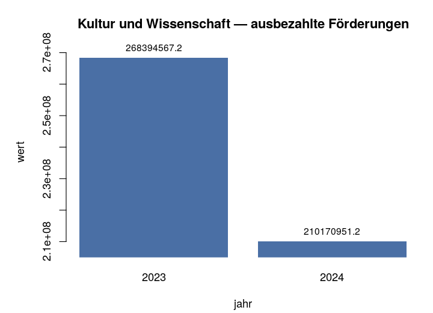
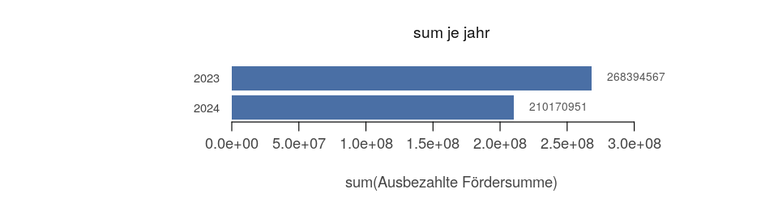

# Data

_One sentence: which dataset did you take, and why this one?_
and hallo

## Provenance

_Where do the bytes come from, and how would anyone tell they are the same bytes?_

- **Source:** the URI you fetched the file from
- **Content address:** `sha256:…` — it is in the post you shopped it from
- **Licence:** and whether it permits what you intend to do
- **As of:** when you fetched it. For a query rather than a file: the bounds that are in the URI
  (period, threshold, field list)

This is the first part the opposition recomputes. One line here saves an argument there.

## Format

_What is one row, and what do the columns mean?_

- **A row is:** a tree? a grant? a station on one day? If a row is something other than what you
  think, then every sum over it is something other than what you think.
- **Rows and columns:** how many
- **Time axis:** which column is the clock — and if there are several, which one you took
- **Missing values:** what they look like. `-1` is not a rainfall, `0` is not a planting year
- **What you changed before you started:** separator, encoding, decimal comma

# Exploratory analysis

_What did you look at before you had an opinion?_

## Overview

_What do the data look like as a whole?_

The figure shows the shape: distribution, development over time, orders of magnitude. No thesis
yet — only what anyone would see who looked.

In the text: what is the order of magnitude, and what is the range everything happens in?

```{r img1, echo=FALSE, out.width="100%"}
knitr::include_graphics("eda-overview.png")
```

## Anomalies

_What stands out, and what did you do about it?_

Outliers, gaps, groups with very few observations, values sitting at a boundary. For each anomaly
**one line with the decision**: kept, removed, handled separately — and why.

This is where an exclusion decision belongs. Written here, it is a reasoned choice; written
nowhere, the opposition finds it anyway.

```{r img2, echo=FALSE, out.width="100%"}

```

# Model

_What did you compute your claim with?_

## What was computed

_The computation itself, in one sentence and one formula._

- **Formula:** what against what
- **Method:** and why this one
- **On what:** the whole dataset or a part of it — and if a part, which

The figure shows the result of the computation, not the raw data.

```{r img3, echo=FALSE, out.width="100%"}
knitr::include_graphics("model-computation.png")
```

## Robustness

_What happens to your claim if someone turns one of the knobs?_

Take the one parameter your claim hangs on — the exclusion threshold, the class boundary, the
period — and let it run across a range. The figure shows the curve.

Two honest answers are possible, and both count:

- **It holds:** the claim survives the whole range. Then say so, with numbers.
- **It flips:** past some value it turns around. Then say past which one — and why you picked the
  value you picked anyway.

Leaving this section out is also an answer, and the opposition will name it.

```{r img4, echo=FALSE, out.width="100%"}

```

# Result

_Your claim, in one sentence._

Then: which three steps carry it — the dataset, the one decision in the EDA, the computation.
Anyone who wants to dispute the sentence should know where to start.

And the thing this jam is about: **every number in it comes from the data, and every step can be
recomputed.** Whether the conclusion is right is a different question — and that is the
interesting one.

